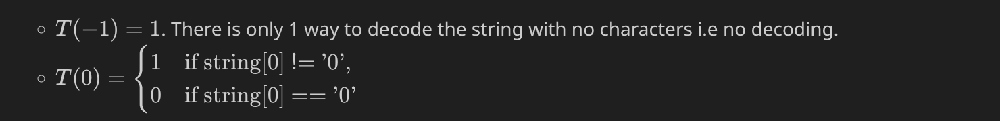
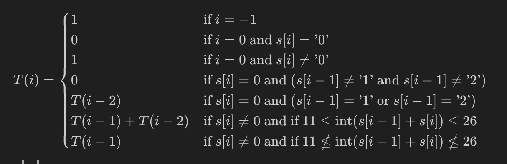
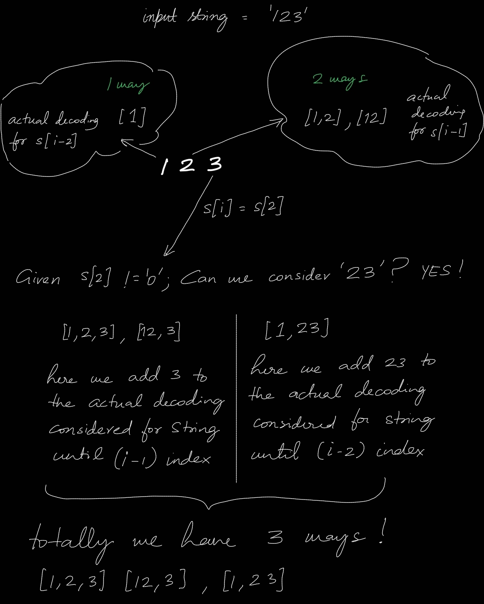
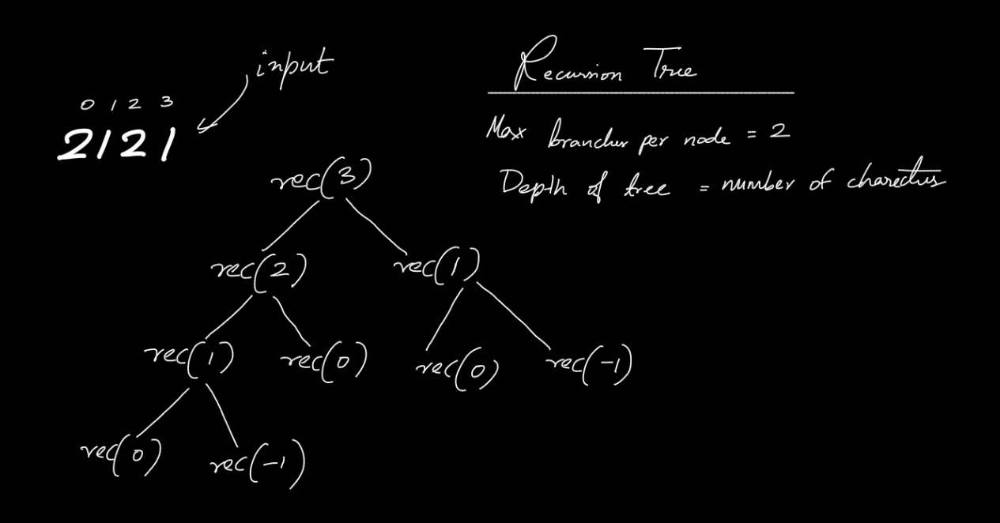

# 91. Decode Ways

Medium [level question on leetcode](https://leetcode.com/problems/decode-ways/description/).

<br>
<br>
<br>

## Clarifications

The question is self explanatory. However, following constraints are provided.

- `1 <= s.length <= 100`
- s contains only digits and may contain leading zero(s).

<br>
<br>
<br>

## Test cases

| Case                               | Input | Output |
| ---------------------------------- | ----- | ------ |
| Single digit                       | 1     | 1      |
| Double digit with valid zero       | 10    | 1      |
| Double digit with invalid zero     | 01    | 0      |
| Double digit with invalid zero     | 40    | 1      |
| Double digits greater than 26      | 29    | 1      |
| Double digits greater less than 26 | 14    | 2      |

<br>
<br>
<br>

## Solution

<br>
<br>

### Recursive solution

```py
class Solution:
    def numDecodings(self, s: str) -> int:
        def rec(i):
            if(i == -1 or (i == 0 and s[i] != '0')):
                return 1
            elif(i == 0 and s[i] == '0'):
                return 0
            elif(s[i] == '0'):
                if(s[i-1] == '1' or s[i-1] == '2'):
                    return rec(i-2)
                else:
                    return 0
            else:
                two_digits = int(s[i-1] + s[i])
                if(11 <= two_digits <= 26):
                    return rec(i-1) + rec(i-2)
                else:
                    return rec(i-1)

        return rec(len(s)-1)
```

```cpp

```

<br>

#### Explanation

Use the framework for solving recusrive question

- The question asks to find the number of ways the string can be decoded, a combinatorial problem. Potentially a DP problem.
- The problem has overlapping subproblems: Given the number of ways to decode the string up to index $i-1$, the number of ways to decode up to index $i$ is either the same as at $i-1$, or the sum of ways at $i-1$ and $i-2$, depending on whether the current character alone or the last two characters together form valid codes. Note that there are many edge cases that needs to be taken care!

1.  Define the objective function.

    $T(i)$ is the number of ways to decode the string until index $i$.

2.  Identify the base cases.

    

3.  Form the recurrance relation.

    

     <br>
     
    - This is a recursive leap of faith i.e. assuming the answers to the previous problems are known.
    - Apart from the base cases,
      - If the current character is zero, consider the previous character only '10' and '20' are valid.
      - If the current character is non-zero, if last two digits are valid, it means the current character can be added to the decodings obtained for `string[:i-1]` and the two digit can be added to the decodings obtained for `string[:i-2]`. See the illustration below :

        

<br>

4. Find the answer.

   The final value returned is the answer to the whole problem.

<br>

#### Complexity analysis

- Time Complexity : This is exponential, $O(2^n)$ solution in terms of time, where $n$ is number of characters in the input string.
  - An illustration of the recursive tree,

    

  - The time complexity is determined by the number of recursive calls which is equal to the number of nodes in the recursive tree. The maximum number of nodes for a tree with depth n and each node having two branches is $2^n$. Checkout [trees](https://github.com/cybergu0ck/notes/blob/main/engineering/software/fundamentals/data-structures/trees/01-trees.md).

- Space Complexity : This is a linear, $O(n)$ solution in terms of space, this is the auxilary stack space.

<br>
<br>

### Top down dp solution

```py
class Solution:
    def numDecodings(self, s: str) -> int:
        mem = {}
        def rec(i):
            if(i in mem):
                return mem[i]
            elif(i == -1 or (i == 0 and s[i] != '0')):
                return 1
            elif(i == 0 and s[i] == '0'):
                return 0
            elif(s[i] == '0'):
                if(s[i-1] == '1' or s[i-1] == '2'):
                    mem[i] = rec(i-2)
                    return mem[i]
                else:
                    mem[i] = 0
                    return 0
            else:
                two_digits = int(s[i-1] + s[i])
                if(11 <= two_digits <= 26):
                    mem[i] = rec(i-1) + rec(i-2)
                    return mem[i]
                else:
                    mem[i] = rec(i-1)
                    return mem[i]

        return rec(len(s)-1)
```

```cpp

```

<br>

#### Explanation

Memoize the recursive solution using a map.

<br>

#### Complexity analysis

- Time Complexity : This is a linear, $O(n)$ solution in terms of time, where $n$ is number of characters in the input string.
  - The recursion function is called once for every index.
- Space Complexity : This is a linear, $O(n)$ solution in terms of space, this is the auxilary stack space.

<br>
<br>

### Bottom up dp solution

```py
class Solution:
    def numDecodings(self, s: str) -> int:
        dp = [0 for _ in range(len(s)+1)]
        dp[0] = 1 #base case : for string index -1
        dp[1] = 1 if s[0] != '0' else 0     #base case : for string index 0


        #Use start enumerate's start parameter to favor the actual string indexing and manually tweak the dp indexing below!
        for i, v in enumerate(dp[2:], start=1):
            if(s[i] == '0'):
                if(s[i-1] == '1' or s[i-1] == '2'):
                    dp[i+1] = dp[i-2+1]
                else:
                    dp[i+1] = 0
            else:
                if( 11 <= int(s[i-1] + s[i]) <=26):
                    dp[i+1] = dp[i-1+1] + dp[i-2+1]
                else:
                    dp[i+1] = dp[i-1+1]

        return dp[-1]

```

```cpp

```

<br>

#### Explanation

Tabulation using 1D array.

<br>

#### Complexity analysis

- Time Complexity : This is a linear, $O(n)$ solution in terms of time, where $n$ is number of characters in the input string.
- Space Complexity : This is a linear, $O(n)$ solution in terms of space, where $n$ is the size of the 1D array.

<br>
<br>

### Bottom up dp solution with space optimisation

```py
class Solution:
    def numDecodings(self, s: str) -> int:
        prev_prev = 1 #base case : for string index -1
        prev = 1 if s[0] != '0' else 0     #base case : for string index 0

        for i,v in enumerate(s[1:], start=1):
            temp = prev
            if(s[i] == '0'):
                if(s[i-1] == '1' or s[i-1] == '2'):
                    prev = prev_prev
                    prev_prev = temp
                else:
                    prev = 0
                    prev_prev = temp
            else:
                if( 11 <= int(s[i-1] + s[i]) <=26):
                    prev = prev + prev_prev
                    prev_prev = temp
                else:
                    prev_prev = prev
                    prev = prev #no change

        return prev
```

```cpp

```

<br>

#### Explanation

Tabulation using variables.

<br>

#### Complexity analysis

- Time Complexity : This is a linear, $O(n)$ solution in terms of time, where $n$ is number of characters in the input string.
- Space Complexity : This is a constant, $O(1)$ solution in terms of space.

<br>
<br>
<br>

## Follow ups

- Return the actual decodings!

<!-- TODO - Try this-->

<br>
<br>
<br>

## Notes

- This is a very good question! It becomes easy to understand once the actual decoding and the number of ways to decode are differntaiated. Also, there are more edge cases.

<br>
<br>
<br>

## Resources

- [Knapsack](https://www.youtube.com/watch?v=W4rYz-kd-cY)'s video is pretty much the only video which explains the above algorithm!

- Replaced the following latex with images, storing the latex here just in case.
  - $T(-1) = 1$. There is only 1 way to decode the string with no characters i.e no decoding.
  - $T(0) = \begin{cases} 1 \quad \text{if string[0] != '0'}, \\ 0 \quad \text{if string[0] == '0'}\end{cases}$

  $T(i) = \begin{cases}
    1 & \text{if } i = -1 \\
    0 & \text{if } i = 0 \text{ and } s[i] = \text{'0'}\\
    1 & \text{if } i = 0 \text{ and } s[i] \neq \text{'0'} \\
    0 & \text{if } s[i] = 0 \text{ and } (s[i-1] \neq \text{'1'} \text{ and } s[i-1] \neq \text{'2'}) \\
    T(i-2) & \text{if } s[i] = 0 \text{ and } (s[i-1] = \text{'1'} \text{ or } s[i-1] = \text{'2'}) \\
    T(i-1) + T(i-2) &  \text{if } s[i] \neq 0 \text{ and } \text{if } 11 \leq \text{int}(s[i-1]+s[i]) \leq 26\\
    T(i-1) & \text{if } s[i] \neq 0 \text{ and } \text{if } 11 \nleq \text{int}(s[i-1]+s[i]) \nleq 26\\
    \end{cases}$

<br>
<br>
<br>
