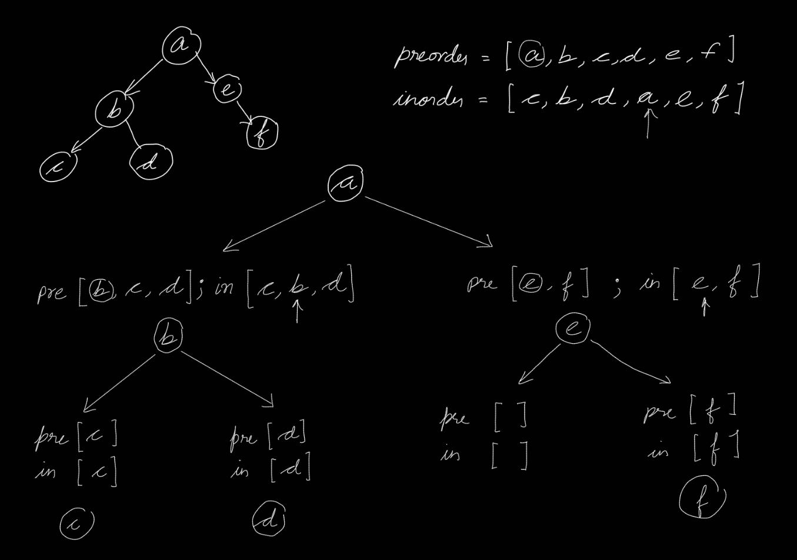

# Template

Medium [level question on leetcode](https://leetcode.com/problems/construct-binary-tree-from-preorder-and-inorder-traversal/description/).

<br>
<br>
<br>

## Clarifications

- Is the binary tree of a specific kind?
  - No, but the values in the binary tree are unique. Hence, preorder and inorder consist of unique values.

<br>
<br>
<br>

## Test cases

| Case           | Input                                             | Output                  |
| -------------- | ------------------------------------------------- | ----------------------- |
| Multiple nodes | preorder = [3,9,20,15,7], inorder = [9,3,15,20,7] | [3,9,20,null,null,15,7] |
| Single node    | preorder = [-1], inorder = [-1]                   | [-1]                    |
| No node        | preorder = [], inorder = []                       | []                      |

<br>
<br>
<br>

## Solution

<br>
<br>

### Quadratic solution

```py
# Definition for a binary tree node.
# class TreeNode:
#     def __init__(self, val=0, left=None, right=None):
#         self.val = val
#         self.left = left
#         self.right = right
class Solution:
    def buildTree(self, preorder: List[int], inorder: List[int]) -> Optional[TreeNode]:
        if not preorder or not inorder:
            return None

        root = TreeNode(preorder[0])
        root_index = inorder.index(preorder[0]) #O(n) operation

        root.left = self.buildTree(preorder[1:root_index+1], inorder[:root_index])
        root.right = self.buildTree(preorder[root_index+1:], inorder[root_index+1:])

        return root
```

```cpp

```

<br>

#### Explanation

Recursively build the tree using the knowledge of tree traversal.

- The first element in the preorder traversal is always the root of the tree.
- In the inorder traversal, all elements before the root belong to the left subtree, and all elements after the root belong to the right subtree.
- If `root_node_index` is the index of the root node in the inorder traversal, then `preorder[1:root_node_index+1]` will contain all the nodes present only in the left subtree and `preorder[root_node_index+1:]` will contain all the nodes present only in the right subtree.

<br>



<br>

#### Complexity analysis

- Time Complexity : This is a quadratic, $O(n^2)$ solution in terms of time, where $n$ is number of nodes in the binary tree.
  - The time complexity is determined by the number of recursive calls multiplied by the time complexity of a single recursive call.
  - The recursive function is called for every node in the tree i.e. $O(n)$ and the recursive function itself is $O(n)$ because of python list's `index` method and also because the slicing of list is $O(k)$.
- Space Complexity : This is a linear, $O(n)$ solution in terms of space, where $n$ is number of nodes in the binary tree.
  - This is the recustion stack space.

<br>
<br>

### Linear solution

```py
# Definition for a binary tree node.
# class TreeNode:
#     def __init__(self, val=0, left=None, right=None):
#         self.val = val
#         self.left = left
#         self.right = right
class Solution:
    def buildTree(self, preorder: List[int], inorder: List[int]) -> Optional[TreeNode]:

        inorder_index_map = {val: idx for idx, val in enumerate(inorder)}
        self.cur_node_index = 0 #This is the node in the preoder list

        def rec(l, r):
            #l and r basically signifies range in the inorder part
            if l > r:
                return None

            root = TreeNode(preorder[self.cur_node_index])
            root_index = inorder_index_map[preorder[self.cur_node_index]] #O(1)

            self.cur_node_index += 1 #Visited the node

            root.left = rec(l, root_index-1)
            root.right = rec(root_index+1, r)

            return root

        return rec(0, len(inorder)-1)
```

```cpp

```

<br>

#### Explanation

Recursively build the tree using efficient index-based traversal with a hashmap for quick root lookup.

- Utilize a hash map to store the indices of values in the inorder traversal for O(1) root position lookups.
- Utilize a global pointer to track the current root node in the preorder sequence.
- Utilize (l,r) pointers to track the range in the inorder sequence, avoiding slicing.
- Recursively build the (l,r) range for the left and right subtree using the index obtained from the map.

<br>

#### Complexity analysis

- Time Complexity : This is a linear, $O(n)$ solution in terms of time, where $n$ is the number of nodes in the tree.
  - The time complexity is determined by the number of recursive calls multiplied by the time complexity of a single recursive call.
  - The recursive function is called for every node in the tree i.e. $O(n)$ and the recursive function itself is $O(1)$.
- Space Complexity : This is a linear, $O(n)$ solution in terms of space, where $n$ is recursive stack size.

<br>
<br>
<br>

## Follow ups

<br>
<br>
<br>

## Notes

- The optimal linear soluton needs some thinking, but can be easily followed from the logic used in the quadratic solution.
- Python list's `index` method and it's slicing are both linear time operations.
- Know about tree traversals.
- The first element of a preorder traversal is the root of the tree.

<br>
<br>
<br>

## Resources

- Followed [neetcode](https://neetcode.io/problems/binary-tree-from-preorder-and-inorder-traversal?list=neetcode150)'s solution.

<br>
<br>
<br>
