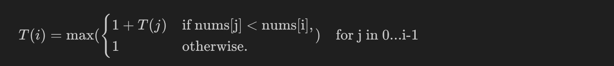

# 300. Longest Increasing Subsequence

Medium [level question on leetcode](https://leetcode.com/problems/longest-increasing-subsequence/description/).

<br>
<br>
<br>

## Clarifications

- Confirm the definition of subsequence.
  - A subsequence is an array that can be derived from another array by deleting some or no elements without changing the order of the remaining elements.

* Can the input array be empty?
  - `1 <= nums.length <= 2500`

* The question seeks the longest strictly increasing subsequence.

<br>
<br>
<br>

## Test cases

| Case                   | Input       | Output |
| ---------------------- | ----------- | ------ |
| Single element         | [1]         | 1      |
| Continously increasing | [1,2,3]     | 3      |
| Continously decreasing | [3,2,1]     | 0      |
| Increase and decrease  | [1,2,3,1]   | 3      |
| Decrease and increase  | [3,2,1,2,3] | 3      |
| Increase and increase  | [1,2,1,2,3] | 3      |

- The above test cases look complete.

<br>
<br>
<br>

## Solution

<br>
<br>

### Recursive solution

```py
class Solution:
    def lengthOfLIS(self, nums: List[int]) -> int:
        def rec(i):
            "longest increasing subsequence considering it includes and ends with nums[i]"
            if(i == 0):
                return 1

            longest = 1
            for j in range(i):
                if(nums[i] > nums[j]):
                    longest = max(longest, 1 + rec(j))

            return longest

        #The longest increasing subsequence might be ending with any of the index not necessarily the last one
        res = 0
        for i in range(len(nums)):
            res = max(res, rec(i))

        return res
```

```cpp

```

<br>

#### Explanation

Use the dp framework as the question can be solved using dynamic programming:

- The problem is about finding longest increasing subsequence, an optimisation problem. Potentially a DP problem.
- The problem has overlapping subproblems: The subsequence of the longest increasing subsequence must also be increasing!

<br>

#### Objective function

$T(i)$ is the longest increasing sequence specifically ending at index $$i$.

- This does not necessarily represent the longest subsequence that includes all elements up to the $i'th$ index.
- Instead, it specifically looks at subsequences that have nums[i] as their last element!

<br>

#### Base cases

1. $T(0) = 1$, The longest increasing sequence at zeroth index is 1.

<br>

#### Recurrance relation



<br>

- This is not a recursive leap of faith!
  - We cannot take a recursive leap of faith here because there the question imposes a sense of direction from left to right. We cannot choose to stand at the rightmost value and look back.
- This recurrance relation is for the logic used inside the recursive function!
- We iterate over all the elements until the current, We have two options for every iteration. The output of the recursive function is the maximum of all the iterations.

<br>

#### Where to find the answer

Unlike usual, we need to iterate over all the elements and call the recursive function. The answer will the maximum of these iterations.

<br>

#### Complexity analysis

- Time Complexity : This is a factorial, $O(n*n!)$ solution in terms of time, where $n$ is the size of the input array.
  - The time complexity of the recursive function is determined by the number of recursive calls which is equal to the number of nodes in the recursive tree. The maximum number of nodes for a tree with depth $n$ and the branches for level $$j$ is $n-j$ is given by $n!$.

    <!-- TODO - Add the image of the recursive tree and the proof for the above case in the relavant notes -->
    - The time complexity of the overall function is therefore $O(n*n!)$.

- Space Complexity : This is a linear, $O(n)$ solution in terms of space, This is the auxilary stack space.

<br>
<br>

### Top down dp solution

```py
class Solution:
    def lengthOfLIS(self, nums: List[int]) -> int:
        mem = {}

        def rec(i):
            "longest increasing subsequence considering it includes and ends with nums[i]"
            if(i in mem):
                return mem[i]

            if(i == 0):
                return 1

            longest = 1
            for j in range(i):
                if(nums[i] > nums[j]):
                    longest = max(longest, 1 + rec(j))

            mem[i] = longest
            return longest

        #The longest increasing subsequence might be ending with any of the index not necessarily the last one
        res = 0
        for i in range(len(nums)):
            res = max(res, rec(i))

        return res
```

<br>

#### Explanation

Memoize the recursive solution using a map.

<br>

#### Complexity analysis

- Time Complexity : This is a quadratic, $O(n^2)$ solution in terms of time, where $n$ is size of the input array.
  - Memoization ensures that the actual logic in the recursive calls are executed only once for a given parameter. Hence the time complexity of the recursive function is cut down to $O(n)$.

  - The time complexity of the overall algorithm is $O(n*n)$.

- Space Complexity : This is a linear, $O(n)$ solution in terms of space, where $n$ is the size of the map.

<br>
<br>

### Bottom up dp solution

```py
class Solution:
    def lengthOfLIS(self, nums: List[int]) -> int:
        dp = [1 for num in nums]

        for i in range(1,len(nums)):
            for j in range(i):
                if nums[j] < nums[i]:
                    dp[i] = max(dp[i], 1+dp[j])
        return max(dp)
```

<br>

#### Explanation

Use Tabulation with 1D dp array.

<br>

#### Complexity analysis

- Time Complexity : This is a quadratic, $O(n^2)$ solution in terms of time, where $n$ is size of the input array.
- Space Complexity : This is a linear, $O(n)$ solution in terms of space, where $n$ is the size of the dp array.
  - The space complexity of this this cannot be reduced further by using variables instead of the array because the answer is not always in the previous state.

<br>
<br>
<br>

## Follow ups

- Find the actual subsequnce as a follow up question. <!-- TODO -->

<br>
<br>
<br>

## Notes

- This is a unqiue case of the DP framework, where the answer is not in the final value!

<br>
<br>
<br>

## Resources

- Replaced the following latex with image. Keeping the latex here, just in case.

  $T(i) = \max (\begin{cases} 1 + T(j) & \text{if nums[j] < nums[i]}, \\ 1 & \text{otherwise}. \end{cases}) \quad{\text{for j in 0...i-1}}$

<br>
<br>
<br>
