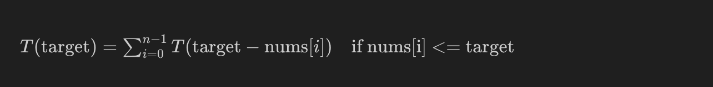

# 377. Combination Sum IV

Medium [level question on leetcode](https://leetcode.com/problems/combination-sum-iv/description/).

<br>
<br>
<br>

## Clarifications

1. What is the type of data stored in the array?
   - Integers

1. Is the array sorted?
   - No

1. Is the array comprised of unique elements?
   - Yes

1. Can the array be modified?
   - Nothing specified

1. Can the array be empty?
   - `1 <= nums.length <= 200`

<br>
<br>
<br>

## Test cases

| Case              | Input                      | Output |
| ----------------- | -------------------------- | ------ |
| Possible case     | nums = [1,2,3], target = 4 | 7      |
| Not possible case | nums = [9], target = 3     | 0      |

<br>
<br>
<br>

## Solution

<br>
<br>

### Top down recursive solution

```py
class Solution:
    def combinationSum4(self, nums: List[int], target: int) -> int:
        def dfs(target):
            if target == 0:
                return 1
            numWays = 0
            for num in nums:
                if num <= target:
                    numWays += dfs(target-num)
            return numWays

        return dfs(target)
```

```cpp

```

<br>

#### Explanation

Since the question has both "Optimal substructure" and "Overlapping subproblems", we can try Dynamic programming's framework.

- The question has "Optimal substructure".
  - Suppose we have to find number of possible combinations that add upto 5 and we have nums = [1]. Now picking the number 1 would mean that we have to find the number of possible combinations that add upto 4.
- The questin has "Overlapping subproblems".
  - We can see the repetation of calculation.

<br>

1.  Define the objective function.

    $T(i)$ is the number of ways to use the numbers and add upto $i$.

2.  Identify the base cases.

    $T(0) = 1$
    - There is no way to add upto zero, this itself is 1 way.

3.  Form the recurrance relation.

    
    - This is a recursive leap of faith, meaning we are assuming we know the answers to the previous problems.
    - Given a target, consider the valid numbers in the array and then calculate the number of ways for the remaining amount.

4.  Find the answer.

    The summed value is the answer to the whole problem.

<br>

#### Complexity analysis

- Time Complexity : This is a exponential, $O(k^n)$ solution in terms of time, where $k$ is length of the `nums` array and $n$ is the target.
  - The time complexity is determined by the number of recursive calls which is equal to the number of nodes in the recursive tree. The maximum number of nodes in a tree with depth of $n$ and each node having $k$ branches is

    $$\frac{k^{(n+1)} - 1}{k - 1}$$

  - Here, the depth of the recursion tree is equal to the value of the target and the maximum number of branches at each node is equal to the number of elments in the `nums` array.

- Space Complexity : This is a linear, $O(n)$ solution in terms of space, where $n$ is target.
  - This is the space consumed by the recursion stack.

<br>
<br>

### Top down recursive solution with memoization

```py
class Solution:
    def combinationSum4(self, nums: List[int], target: int) -> int:
        mem = dict()
        def dfs(target):
            if target in mem:
                return mem[target]
            if target == 0:
                return 1
            numWays = 0
            for num in nums:
                if num <= target:
                    numWays += dfs(target-num)
            mem[target] = numWays
            return numWays

        return dfs(target)
```

```cpp

```

<br>

#### Explanation

Memoize the [above](#top-down-recursive-solution) solution using a map.

<br>

#### Complexity analysis

- Time Complexity : This is a bilinear, $O(n*k)$ solution in terms of time, where $n$ is target value and $k$ is the number of elements in the `nums` array.
  - By cacheing the calculated values, we avoid repeated calculations.
  - The recursive function runs once for each value until the target, $n$.
  - The recursive function itself is a $O(k)$, where $k$ is the length of the `nums` array. This is the looping.

- Space Complexity : This is a linear, $O(n)$ solution in terms of space, where $n$ is target value.
  - Space used by the map.
  - Space is used by the recursive stack as well.

<br>
<br>

### Bottom up solution

```py
class Solution:
    def combinationSum4(self, nums: List[int], target: int) -> int:
        dp = [0 for i in range(target+1)]
        dp[0]=1

        for i in range(1,target+1):
            for num in nums:
                if num <= i:
                    dp[i] += dp[i-num]

        return dp[-1]
```

```cpp

```

<br>

#### Explanation

Use 1D array and recurrance relation to code the bottom up dp approach.

<br>

#### Complexity analysis

- Time Complexity : This is a bilinear, $O(n*k)$ solution in terms of time, where $n$ is target value and $k$ is the number of elements in the `nums` array.
  - The outer loop is of $O(n)$ time.
  - The inner loop is of $O(k)$ time.
  - Overall the time is of $O(n*k)$.

- Space Complexity : This is a linear, $O(n)$ solution in terms of space, where $n$ is target value.
  - Space used by the 1D array.
  - There is no recursion stack here.

<br>
<br>
<br>

## Follow ups

<br>
<br>
<br>

## Notes

- This question is essentially a "coin change" or "make change" question.

- [Bottom up](#bottom-up-solution) solution is the optimal solution over [top down](#top-down-recursive-solution-with-memoization) solution with memoization.
  - There is no recursin stack.
  - It is always best to avoid recursion whenever possible.

<br>
<br>
<br>

## Resources

- The original latex syntax for the above image.

  $T(\text{target}) = \sum_{i=0}^{n-1} T(\text{target} - \text{nums}[i])  \quad \text{if \text{nums}[i] <= \text{target}}$

<br>
<br>
<br>
